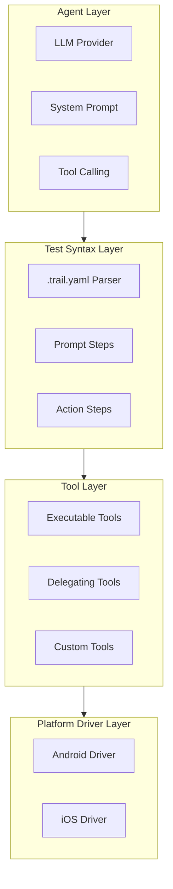
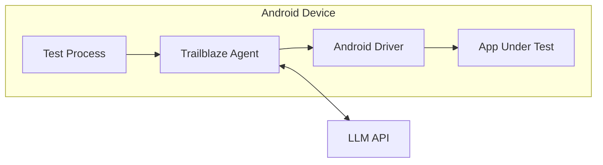
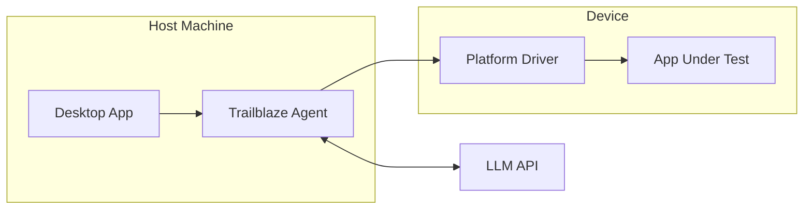

# Architecture

This document describes the software architecture and key design decisions of the Trailblaze framework.

## Technology Stack

| Technology                | Purpose                                                                  |
|---------------------------|--------------------------------------------------------------------------|
| **Kotlin**                | Primary language for all modules (Kotlin Multiplatform where applicable) |
| **Gradle (Kotlin DSL)**   | Build system with version catalogs (`libs.versions.toml`)                |
| **Kotlin Serialization**  | JSON serialization for tools, logs, and API communication                |
| **Kotlin Coroutines**     | Async execution for tool calls and LLM interactions                      |
| **Compose Multiplatform** | Desktop application UI                                                   |
| **Compose Material 3**    | UI component library and theming                                         |
| **Ktor**                  | HTTP client for LLM API calls, server for log aggregation                |

### Why Kotlin?

- **Multiplatform support** - Share code between Android on-device and JVM host modes
- **Coroutines** - Clean async APIs for LLM calls and tool execution
- **Serialization** - First-class support for JSON serialization with annotations
- **Type safety** - Catch errors at compile time, especially important for tool definitions
- **Android ecosystem** - Native integration with Android instrumentation testing

### Kotlin Multiplatform Strategy

We aim to write as much code as possible in `commonMain` source sets for maximum reusability:

```
src/
├── commonMain/     # Preferred - platform-agnostic code
├── jvmMain/        # JVM-specific (desktop, host mode)
└── androidMain/    # Android-specific (on-device mode)
```

**Why `commonMain`?** Code in `commonMain` can be shared across all targets, reducing duplication and ensuring
consistent behavior.

**JVM Constraints:** Some code must be JVM-specific due to dependencies:

- **Maestro** - The device interaction library is JVM-only, so driver implementations live in `jvmMain` or `androidMain`
- **File I/O** - Some file operations use JVM-specific APIs
- **Desktop UI** - Compose Desktop targets JVM

When adding new code, prefer `commonMain` unless there's a specific platform requirement.

### UI with Compose Material 3

The Desktop application uses Compose Multiplatform with Material 3:

- **Material 3 Components** - Buttons, cards, dialogs, navigation, etc.
- **Dynamic Theming** - Support for light/dark modes
- **Material Icons Extended** - Comprehensive icon library
- **Multiplatform Markdown Renderer** - For displaying test documentation

UI code lives primarily in `trailblaze-ui` (shared components) and `trailblaze-desktop` (application shell).

### Build Structure

The project uses Gradle with Kotlin DSL and a multi-module structure:

```
opensource/
├── build.gradle.kts              # Root build configuration
├── gradle/libs.versions.toml     # Centralized dependency versions
├── trailblaze-agent/             # Core agent logic
├── trailblaze-android/           # Android on-device driver
├── trailblaze-common/            # Shared utilities and tools
├── trailblaze-desktop/           # Desktop application
├── trailblaze-host/              # Host-mode driver
├── trailblaze-models/            # Data models (Kotlin Multiplatform)
├── trailblaze-report/            # Reporting utilities
├── trailblaze-server/            # Log server
└── trailblaze-ui/                # Shared UI components
```

## Overview

Trailblaze is a layered architecture that separates AI reasoning from platform-specific execution:



## Design Principles

### 1. Platform Agnostic Agent

The Trailblaze agent is designed to be platform-agnostic. It reasons about UI interactions using natural language and a
standardized tool interface, without knowledge of the underlying platform implementation.

**Why?** This allows the same test logic to work across different platforms and enables future extensibility.

### 2. Tool-Based Execution

All device interactions are expressed as **tools** that the agent can invoke. Tools provide a clean abstraction between
the agent's intent and the platform-specific implementation.

**Why?** Tools are:

- Composable and reusable
- Easy to extend with custom implementations
- Testable in isolation
- Self-documenting via annotations

### 3. Deterministic + AI Hybrid

Tests can combine deterministic actions (always execute the same way) with AI-driven steps (adapt to screen state). This
provides both reliability and flexibility.

**Why?** Pure AI tests can be unpredictable; pure scripted tests are brittle. The hybrid approach gives test authors
control over the trade-off.

## Key Components

### MaestroTrailblazeAgent

The abstract base class for all Trailblaze agents. It provides:

- Tool execution framework
- Memory for storing data between steps
- Logging integration
- Support for both blocking and suspending execution

```kotlin
abstract class MaestroTrailblazeAgent : TrailblazeAgent {
    abstract suspend fun executeMaestroCommands(commands: List<Command>, traceId: TraceId?)
    val memory = AgentMemory()
    fun runTrailblazeTools(tools: List<TrailblazeTool>): RunTrailblazeToolsResult
}
```

**Implementations:**

- `AndroidMaestroTrailblazeAgent` - On-device Android execution
- `HostMaestroTrailblazeAgent` - Host-mode execution for Android/iOS

### Tool System

Tools are the primary abstraction for device interactions. There are two main types:

#### ExecutableTrailblazeTool

Tools that directly perform actions:

```kotlin
interface ExecutableTrailblazeTool : TrailblazeTool {
    suspend fun execute(toolExecutionContext: TrailblazeToolExecutionContext): TrailblazeToolResult
}
```

Examples: `tapOnElementWithText`, `inputText`, `assertVisible`

#### DelegatingTrailblazeTool

Tools that expand into multiple executable tools:

```kotlin
interface DelegatingTrailblazeTool : TrailblazeTool {
    fun toExecutableTrailblazeTools(context: TrailblazeToolExecutionContext): List<ExecutableTrailblazeTool>
}
```

**Why delegating tools?** They allow complex, multi-step operations to be exposed as single tool calls to the agent,
reducing token usage and improving reliability.

### Custom Tools

Applications can define custom tools for app-specific interactions:

```kotlin
@Serializable
@TrailblazeToolClass("signInWithEmailAndPassword")
@LLMDescription("Sign in using email and password")
data class SignInTool(val email: String, val password: String) : MapsToMaestroCommands {
    override fun toMaestroCommands(): List<Command> = listOf(/* commands */)
}
```

**Why?** Custom tools let teams encode domain knowledge and reduce test verbosity.

## Extensibility

Trailblaze is designed to be extended without modifying the core framework. There are several extension points:

### Custom Tools

The primary extension mechanism. Define tools as Kotlin data classes with annotations:

```kotlin
@Serializable
@TrailblazeToolClass("myCustomAction")
@LLMDescription("Description shown to the LLM")
data class MyCustomTool(
    val param1: String,
    val param2: Int
) : ExecutableTrailblazeTool {
    override suspend fun execute(context: TrailblazeToolExecutionContext): TrailblazeToolResult {
        // Custom implementation
        return TrailblazeToolResult.Success
    }
}
```

Tools are automatically:

- Serialized to JSON for LLM function calling
- Documented via `@LLMDescription` annotations
- Validated at compile time via Kotlin's type system

### Test Rules

Create reusable test base classes that configure the agent:

```kotlin
class MyAppTrailblazeTest(
    testTimeoutMinutes: Int = 10
) : TrailblazeTestRule(
    customTools = listOf(MyCustomTool::class),
    // ... other configuration
)
```

### Platform Drivers

Implement `MaestroTrailblazeAgent` to add support for new platforms:

```kotlin
class WebTrailblazeAgent : MaestroTrailblazeAgent() {
    override suspend fun executeMaestroCommands(
        commands: List<Command>,
        traceId: TraceId?
    ): TrailblazeToolResult {
        // Translate commands to web automation
    }
}
```

### LLM Providers

The agent communicates with LLMs through an abstraction that can be swapped:

- Default: OpenAI-compatible API
- Extensible to other providers (Anthropic, local models, etc.)

### Test Syntax (.trail.yaml)

Tests are authored in `.trail.yaml` format, which supports:

#### Prompt Steps (AI-driven)

```yaml
- prompts:
    - step: Navigate to the Settings screen and enable notifications
```

#### Action Steps (Deterministic)

```yaml
- maestro:
    - tapOn: "Settings"
    - assertVisible: "Notifications"
```

#### Recording Hints

```yaml
- prompts:
    - step: Tap the login button
      recording:
        tools:
        - tapOnElementWithText:
            text: "Login"
```

Recording hints guide the agent toward specific tool calls while still allowing adaptation.

## Execution Modes

### On-Device Mode (Android)



The agent runs **inside the test process** on the device. This enables:

- Integration with cloud device farms (Firebase Test Lab, AWS Device Farm)
- No host machine required
- Parallel execution at scale

### Host Mode



The agent runs on a **host machine** and controls devices remotely. This enables:

- Cross-platform testing (Android + iOS)
- Interactive test authoring via Desktop app
- Local development workflow

## Platform Drivers

Platform drivers translate tool calls into device-specific actions.

### Current Implementation

For mobile platforms, Trailblaze uses [Maestro](https://maestro.mobile.dev) internally as the device interaction layer.
However:

- **This is an implementation detail** - users interact with Trailblaze tools, not Maestro directly
- **Not all Maestro features are exposed** - only the subset needed for Trailblaze tools
- **The driver is replaceable** - the architecture supports alternative implementations

### Driver Interface

Drivers must implement command execution:

```kotlin
abstract suspend fun executeMaestroCommands(
    commands: List<Command>,
    traceId: TraceId?
): TrailblazeToolResult
```

## Logging & Reporting

All tool executions are logged with:

- Tool name and parameters
- Execution duration
- Success/failure status
- Trace IDs for correlation
- Session information

Logs are sent to the Trailblaze server for aggregation and reporting.

## Memory System

The `AgentMemory` class allows tests to store and retrieve data:

```kotlin
// Store a value
memory.set("username", "test@example.com")

// Retrieve in a later step
val username = memory.get("username")
```

**Why?** Memory enables multi-step tests where later steps depend on data from earlier steps (e.g., storing a generated
ID).

## Code Conventions

### Kotlin Style

- Follow [Kotlin coding conventions](https://kotlinlang.org/docs/coding-conventions.html)
- Use coroutines for async operations (avoid callbacks)
- Prefer `val` over `var` (immutability)
- Use data classes for DTOs and tool definitions
- Use sealed classes for restricted hierarchies (e.g., `TrailblazeToolResult`)

### Tool Definitions

- Always annotate with `@Serializable`, `@TrailblazeToolClass`, and `@LLMDescription`
- Keep tool parameters simple (primitives, strings, enums)
- Write clear `@LLMDescription` text - the LLM uses this to decide when to call the tool
- Return `TrailblazeToolResult.Success` or `TrailblazeToolResult.Error` with a helpful message

### Testing

- Use JUnit 4 for tests (`org.junit.Test`)
- Create fake/mock agents for unit testing tools
- Integration tests should use real devices or emulators

### Logging

- Each logger instance maintains its own state (session ID, fallback tracking, end log status). Create a new logger for each test.
- Use `TrailblazeLoggerFactory.create()` to instantiate logger instances
- Each test execution should have its own logger instance for proper isolation
- Pass logger through dependency chain (Rule → Runner → Agent → Driver)
- Include `traceId` for correlation across tool calls
- Log tool execution start, completion, and errors

## Future Considerations

The architecture is designed to support:

- **Additional platform drivers** - Web, desktop, or custom UI frameworks
- **Multiple LLM providers** - Currently supports OpenAI, extensible to others
- **Enhanced recording** - Capture and replay interactions with higher fidelity
- **Distributed execution** - Coordinate agents across multiple devices
