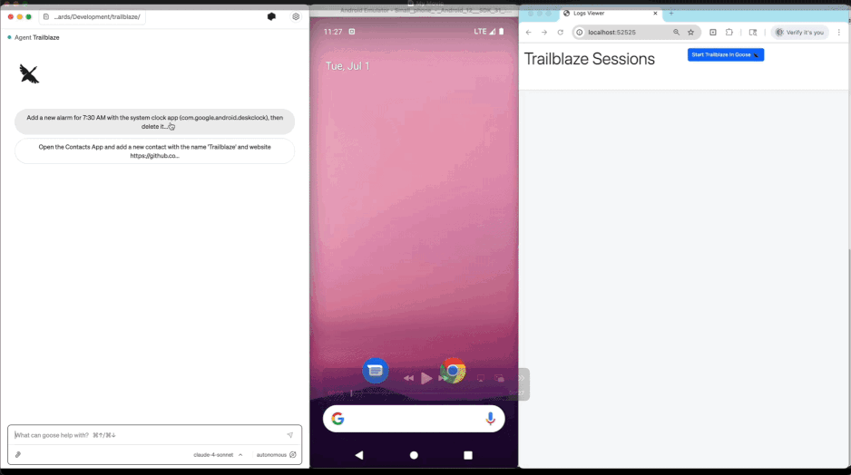

# 🧭 Trailblaze

[Trailblaze](https://github.com/block/trailblaze) is an AI-powered mobile testing framework that lets you author and execute tests using natural language.

## Current Vision

Trailblaze enables adoption of AI powered tests in regular Android on-device instrumentation tests.
This allows leveraging existing execution environments and reporting systems, providing a path to gradually adopt
AI-driven tests at scale.

Because Trailblaze uses [Maestro](https://github.com/mobile-dev-inc/maestro) Command Models for UI interactions it
enables a [Longer Term Vision](#Longer-Term-Vision) of cross-platform ui testing while reusing the same authoring, agent
and reporting capabilities.

### Core Features

- **AI-Powered Testing**: More resilient tests using natural language test steps
- **On-Device Execution**: Runs directly on Android devices using standard instrumentation tests (Espresso, UiAutomator)
- **[Custom Agent Tools](#Custom-Tools)**: Extend functionality by providing app-specific `TrailblazeTool`s to the agent
- **[Detailed Reporting](#Log-Server)**: Comprehensive test execution reports
- **Maestro Integration**: Uses a custom on-device driver for Maestro to leverage intuitive, platform-agnostic UI interactions

### Multi-Agent V3 Features

Trailblaze implements cutting-edge features from [Mobile-Agent-v3](https://arxiv.org/abs/2508.15144) research:

- **[Exception Handling](mobile-agent-v3-features.md#phase-1-exception-handling)**: Automatically handles popups, ads, loading states, and errors
- **[Reflection & Self-Correction](mobile-agent-v3-features.md#phase-2-reflection--self-correction)**: Detects stuck states and loops, backtracks when needed
- **[Task Decomposition](mobile-agent-v3-features.md#phase-3-task-decomposition)**: Breaks complex objectives into manageable subtasks
- **[Cross-App Memory](mobile-agent-v3-features.md#phase-4-cross-app-memory)**: Remembers information across app switches for complex workflows
- **[Enhanced Recording](mobile-agent-v3-features.md#phase-5-enhanced-recording)**: Captures pre/post conditions for more robust replay
- **[Progress Reporting](mobile-agent-v3-features.md#phase-6-progress-reporting)**: Real-time MCP progress events for IDE integrations

See the [Mobile-Agent-v3 Features Guide](mobile-agent-v3-features.md) for detailed usage examples and configuration.

## License

Trailblaze is licensed under the [Apache License 2.0](LICENSE).
