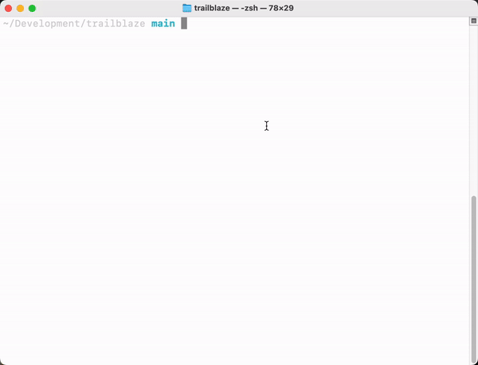

Observability of the test execution and agent performance is crucial to adopting AI-based tests.
Trailblaze includes thorough logging capabilities in all phases of the test execution.

### Start Trailblaze

Run the following to start Trailblaze (including the local log server):

```bash
trailblaze app
```



This initializes a local web server that Trailblaze will send all the logs to on your local machine.
Logs _will not_ be collected if the server is not running.
To view them open [http://localhost:52525](http://localhost:52525) in your browser (port may vary if configured differently in Settings).

### Understanding Test Logs

As tests are executed locally the server will show a list of all Trailblaze Sessions (i.e. all the test runs).
Selecting an individual test will show all the logs which includes:

- Success or failure message
- The prompt provided to the agent
- The list of steps taken during the test
- LLM usage summary

The individual steps are broken up and color coded into a few buckets:

- Session status denotes the start and end of the test
- LLM Request represent each request sent to the LLM
- Trailblaze command denotes which tool call the LLM decided to use for the request
- Driver command denotes the platform-specific action sent to the device, emulator, or browser. Each Trailblaze command maps to one or many driver commands.
- Driver result denotes what the platform driver actually did in response to the command.
