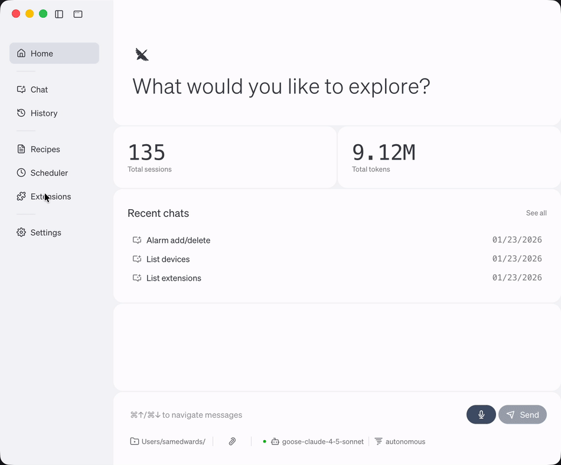
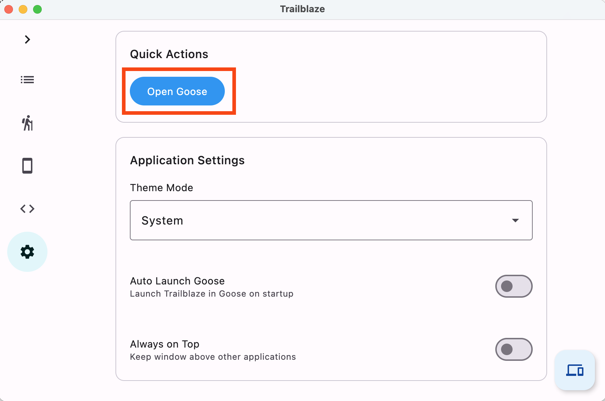
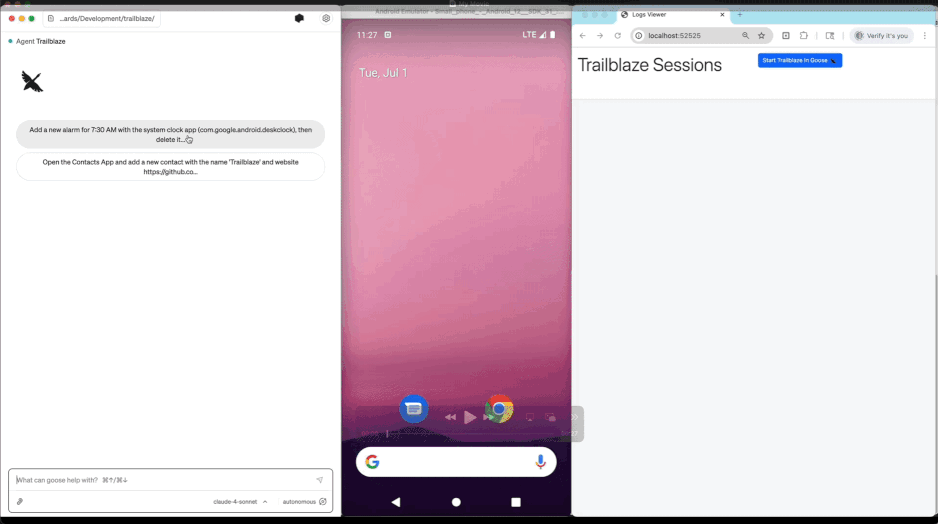

Below are the instructions for using the Trailblaze MCP server with [Goose](https://github.com/block/goose).  

Note: Trailblaze can work with any MCP client, we've just optimized for Goose. 

## MCP Server

Trailblaze includes an MCP server that uses **Streamable HTTP** transport. The endpoint accepts JSON-RPC requests via HTTP POST.

### Connection Flow

1. Client sends POST to `/mcp` with JSON-RPC request body
2. Server creates a session (if new) and returns `Mcp-Session-Id` header
3. Client includes `Mcp-Session-Id` header in subsequent requests
4. Optional: Client can GET `/mcp` (with session header) for server-to-client streaming
5. Client can DELETE `/mcp` (with session header) to terminate the session

## Using Trailblaze with Goose

### 1. Download and Install the Goose Desktop App

- Download the Goose Desktop app to run Trailblaze. [Installation Guide](https://block.github.io/goose/docs/getting-started/installation/) to set it up.
- Configure your LLM API Keys to use Goose [LLM Provider Configuration](https://block.github.io/goose/docs/getting-started/providers).

### 2. Run Trailblaze

This will start the Trailblaze server and web UI.

```shell
./trailblaze
```


### 3. Install the Goose Trailblaze Extension

Now that you have the server running, you can install the Trailblaze extension in Goose. You should only have to do this configuration once.

Add a new Goose Extension with:

- **ID**: `trailblaze`
- **Name**: `Trailblaze`
- **Description**: `A tool to facilitate the creation and execution of mobile ui tests using natural language using the Trailblaze library.`
- **Type**: `streamable_http`
- **URI**: `http://localhost:52525/mcp`



### 4. Start Trailblaze with Goose

Within the Goose Desktop app, click `Open Goose`:



### 5. Use Goose to Interact with Trailblaze



NOTE: The only available device type is `Android` in open source, and it will run on the device itself.

## Development

Start the [MCP Inspector](https://github.com/modelcontextprotocol/inspector) with:

```shell
DANGEROUSLY_OMIT_AUTH=true npm exec --loglevel=verbose @modelcontextprotocol/inspector
```

Add the Trailblaze MCP Server to the MCP Inspector using the Streamable HTTP transport type to explore all the available commands and responses.
