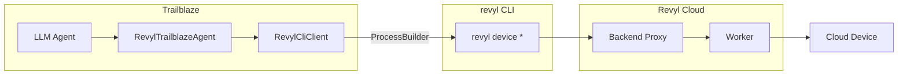

# Revyl Cloud Device Integration

Trailblaze can use [Revyl](https://revyl.ai) cloud devices instead of local ADB or Maestro. This lets you run the same AI-powered tests against managed Android and iOS devices without a local device or emulator.

## Overview

The Revyl integration provides:

- **RevylCliClient** (`trailblaze-revyl`) – Shells out to the `revyl` CLI binary for all device interactions.
- **RevylTrailblazeAgent** (`trailblaze-host`) – Maps every Trailblaze tool to a `revyl device` CLI command.
- **RevylNativeToolSet** (`trailblaze-revyl`) – Revyl-specific LLM tools (tap, type, swipe, assert) using natural language targeting and AI-powered visual grounding.

Core data classes and the CLI client live in the `trailblaze-revyl` module. Host-level wiring (agent, blaze support) lives in `trailblaze-host/.../host/revyl/`.

## Prerequisites

1. Install the `revyl` CLI binary on your PATH:

   ```bash
   curl -fsSL https://raw.githubusercontent.com/RevylAI/revyl-cli/main/scripts/install.sh | sh
   # Or with Homebrew:
   brew install RevylAI/tap/revyl
   ```

2. Set the `REVYL_API_KEY` environment variable (or configure it in Settings > Environment Variables in the desktop app).

**Optional overrides:**

- `REVYL_BINARY` – Path to a specific `revyl` binary (skips PATH lookup).

## Architecture



1. The LLM calls Trailblaze tools (tap, inputText, swipe, etc.).
2. **RevylTrailblazeAgent** dispatches each tool to **RevylCliClient**.
3. **RevylCliClient** runs the corresponding `revyl device` command via `ProcessBuilder` and parses the JSON output.
4. The `revyl` CLI handles auth, backend proxy routing, and AI-powered target grounding transparently.
5. The cloud device executes the action and returns results.

## Quick start

```kotlin
// Prerequisites: revyl CLI on PATH + REVYL_API_KEY set
val client = RevylCliClient()

// Start a cloud device with an app installed
val session = client.startSession(
    platform = "android",
    appUrl = "https://example.com/my-app.apk",
)
println("Viewer: ${session.viewerUrl}")

// Interact using natural language targets
client.tapTarget("Sign In button")
client.typeText("user@example.com", target = "email field")
client.tapTarget("Log In")

// Screenshot
client.screenshot("after-login.png")

// Clean up
client.stopSession()
```

## Supported operations

All 12 Trailblaze tools are fully implemented:

| Trailblaze tool | CLI command |
|-----------------|-------------|
| tap (coordinates) | `revyl device tap --x N --y N` |
| tap (grounded) | `revyl device tap --target "..."` |
| inputText | `revyl device type --text "..." [--target "..."]` |
| swipe | `revyl device swipe --direction <dir>` |
| longPress | `revyl device long-press --target "..."` |
| launchApp | `revyl device launch --bundle-id <id>` |
| installApp | `revyl device install --app-url <url>` |
| eraseText | `revyl device clear-text` |
| pressBack | `revyl device back` |
| pressKey | `revyl device key --key ENTER` |
| openUrl | `revyl device navigate --url "..."` |
| screenshot | `revyl device screenshot --out <path>` |

## Limitations

- No local ADB or Maestro; all device interaction goes through Revyl cloud devices.
- View hierarchy from Revyl is minimal (screenshot-based AI grounding is used instead).
- Requires network access to the Revyl backend.

## See also

- [Architecture](architecture.md) – Revyl as an alternative to HostMaestroTrailblazeAgent.
- [Revyl CLI](https://github.com/RevylAI/revyl-cli) – Command-line tool for devices and tests.
- [Revyl docs](https://docs.revyl.ai) – Full CLI and SDK documentation.
